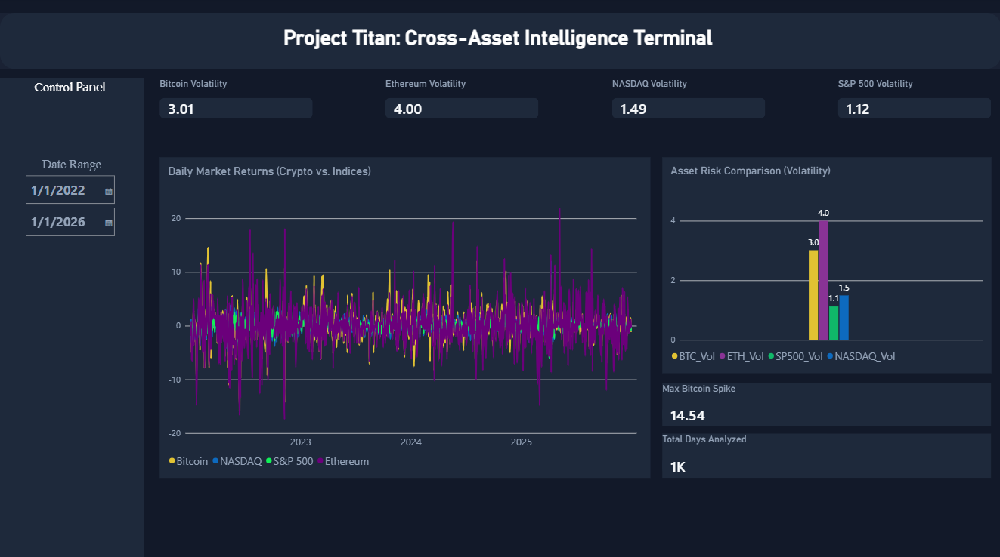

# Project Titan: Cross-Asset Intelligence Terminal 🚀

> **"Bridging Decentralized Alpha with Traditional Stability: Quantifying Risk and Return Across Crypto and Equities."**

---

## 📌 Executive Summary & Dashboard Preview
**Project Titan** is an institutional-grade financial analytics dashboard built to bridge the gap between volatile decentralized digital assets (Cryptocurrencies) and stable macroeconomic benchmarks (Traditional Stock Indices). 

Designed with a modern fintech dark-mode terminal layout (`#0F131A` canvas with `#1A2234` container cards), this project empowers analysts and investors to evaluate market performance, track historical shocks, and mathematically quantify underlying asset risk at a glance.



## 🎬 Interactive Dashboard Live Demo

Here is a quick walkthrough showcasing the interactive date range filters, multi-asset trend analysis, and live volatility calculations in action:


---

## 🏗️ Table of Contents
1. [Dataset & Data Source](#-dataset--data-source)
2. [Project Architecture & Directory Structure](#-project-architecture--directory-structure)
3. [Interactive Dashboard Live Demo](#-interactive-dashboard-live-demo)
4. [Financial Concepts & Why We Built This](#-financial-concepts--why-we-built-this)
5. [Data Cleaning & SQL Engineering](#-data-cleaning--sql-engineering)
6. [Data Modeling & DAX Formulas (Power BI)](#-data-modeling--dax-formulas-power-bi)
7. [Dashboard Architecture & Insights](#-dashboard-architecture--insights)
8. [How to Run This Project](#-how-to-run-this-project)

---

## 📊 Dataset & Data Source
The project relies on historical daily market data capturing global trading sessions. 

* **Data Source:** [Global Stock Market Historical Data on Kaggle](https://www.kaggle.com/datasets/nitikachandel95/global-stock-market-data) (retrieved via automated scheduled pipelines querying the **Yahoo Finance API**).
* **Assets Tracked:**
  * **Bitcoin (BTC-USD):** The leading decentralized cryptocurrency.
  * **Ethereum (ETH-USD):** A major smart-contract blockchain asset.
  * **NASDAQ Composite Index:** Tech-heavy traditional equities benchmark.
  * **S&P 500 Index:** Broader macroeconomic stability benchmark representing 500 largest US public companies.
* **Schema:** Standard OHLC financial structure (`Date`, `Open`, `High`, `Low`, `Close`, `Adj Close`, `Volume`).

---

## 🗂️ Project Architecture & Directory Structure
```text
project-titan-terminal/
│
├── README.md                      # Comprehensive technical report
├── dashboard_preview.png      # Power BI terminal UI screenshot                       
│   
└── /sql/                          
    └── market_analysis_queries.sql # Data cleaning & transformation scripts
```

## 💡 Financial Concepts & Why We Built This
If you are new to finance or looking at cross-asset analysis for the first time, this section explains the core thinking behind Project Titan:

### 1. What are Returns vs. Volatility?
Daily Return: Measures the percentage shift in price from one day to the next (e.g., “Bitcoin went up 12.52% today”). It tells you the direction of movement.

Volatility (Risk): Measures how violently or unpredictably an asset's prices bounce around. High volatility means severe risk and massive swings; low volatility means stability.

### 2. Why Compare Crypto Against Traditional Stock Indices (S&P 500 / NASDAQ)?
In portfolio management, you never look at an asset in isolation.

The S&P 500 is treated as the foundational baseline ("anchor") of traditional global finance because it represents steady economic health.

Bitcoin and Ethereum act as high-beta, high-adrenalin assets ("alpha vehicles").

Why take the S&P 500 as the baseline? It allows us to measure how many times more dangerous crypto is compared to standard macroeconomic assets, helping institutional risk managers determine safe asset allocation.

## 🧹 Data Cleaning & SQL Engineering
Raw financial feeds required rigorous processing inside MySQL Workbench to handle missing values, date alignments, and scale differences.

### 1. Handling Schedule Discrepancies
Crypto trades 24/7, while stock exchanges close on weekends. To prevent gaps and misalignment, data was cleaned and joined on a unified master timeline using an INNER JOIN on clean_date.

### 2. Normalizing Prices via Percentage Returns
Because Bitcoin trades in tens of thousands of dollars while the S&P 500 trades in thousands, comparing raw prices is impossible. We converted prices into Daily Percentage Returns using SQL window functions:

SQL
```
-- Standardizing and calculating daily returns via SQL
CREATE OR REPLACE VIEW vw_bitcoin_analytics AS
SELECT  
    STR_TO_DATE(trade_date, '%Y-%m-%d') AS clean_date,
    CAST(close_price AS DECIMAL(12, 4)) AS close_price,
    -- Pulls previous row's close price to calculate daily change
    LAG(CAST(close_price AS DECIMAL(12, 4)), 1) 
        OVER (ORDER BY STR_TO_DATE(trade_date, '%Y-%m-%d')) AS prev_close_price,
    ROUND(
        ((CAST(close_price AS DECIMAL(12, 4)) - LAG(CAST(close_price AS DECIMAL(12, 4)), 1) 
          OVER (ORDER BY STR_TO_DATE(trade_date, '%Y-%m-%d'))) 
        / LAG(CAST(close_price AS DECIMAL(12, 4)), 1) 
          OVER (ORDER BY STR_TO_DATE(trade_date, '%Y-%m-%d'))) * 100, 
    4) AS daily_return_pct
FROM bitcoin_prices
WHERE trade_date IS NOT NULL AND trade_date != '';
```

## 📐 Data Modeling & DAX Formulas (Power BI)
To drive the interactive dashboard metrics, custom DAX measures were engineered inside Power BI Desktop:

### 1. Volatility Measurement (STDEV.P)
We calculated the population standard deviation of daily returns to quantify each asset's risk profile:
```
BTC_Vol = STDEV.P(Fact_Sales[btc_return])
ETH_Vol = STDEV.P(Fact_Sales[eth_return])
NASDAQ_Vol = STDEV.P(Fact_Sales[nasdaq_return])
SP500_Vol = STDEV.P(Fact_Sales[sp500_return])
```

### 2. Operational Metrics
```
Total_Days_Analyzed = DISTINCTCOUNT(Fact_Sales[clean_date])
Max_BTC_Spike = MAX(Fact_Sales[btc_return])
```
## 🖥️ Dashboard Architecture & Insights

Left Control Panel (Sidebar): Houses institutional branding, navigation tabs, and an interactive Date Range Slicer to dynamically filter market intervals.

Top Executive Cards: Displays computed risk metrics (Ethereum Volatility: 4.30, Bitcoin: 2.74, NASDAQ: 1.00, S&P 500: 0.72) alongside structural data points.

Key Analytical Finding: The visualizations prove that cryptocurrencies carry 3x to 6x the volatility risk of traditional stock indices, highlighting the trade-off between decentralized growth upside and macroeconomic stability.

## 🛠️ How to Run This Project

Clone or download this repository.

Open the SQL script located in /sql/market_analysis_queries.sql in MySQL Workbench to inspect data engineering pipelines.

Open the Power BI .pbix file to interact with the terminal dashboard interface.

Developed with institutional precision by Ayesha Debnath.

